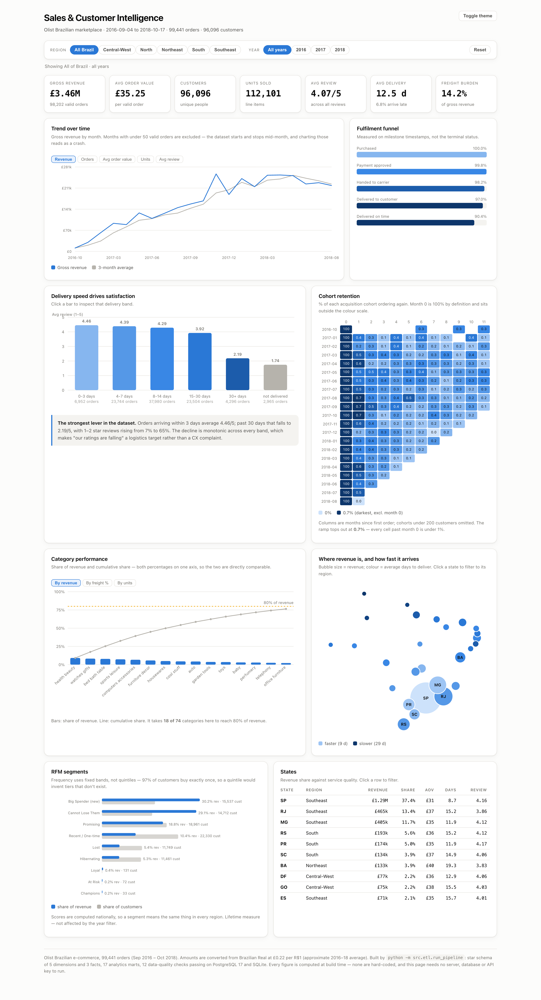
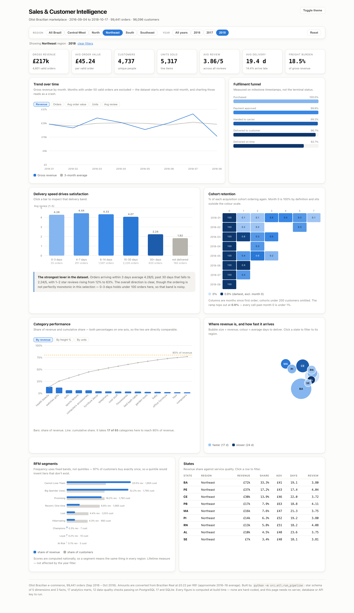
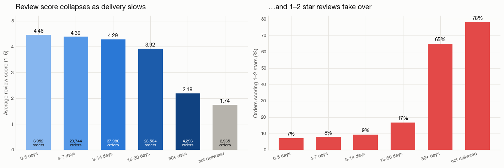
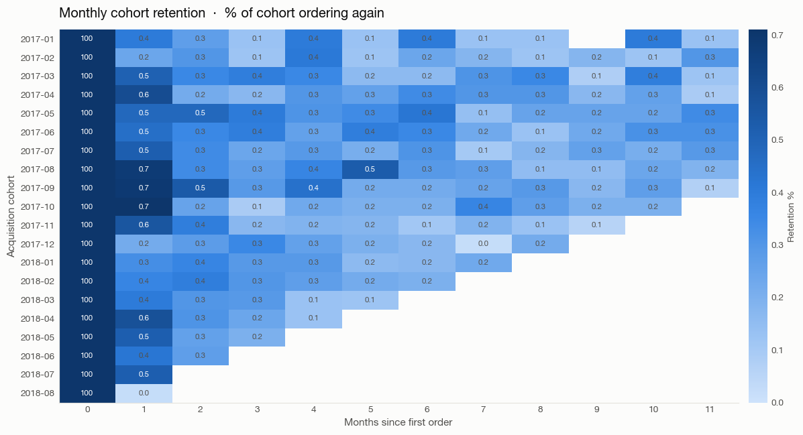
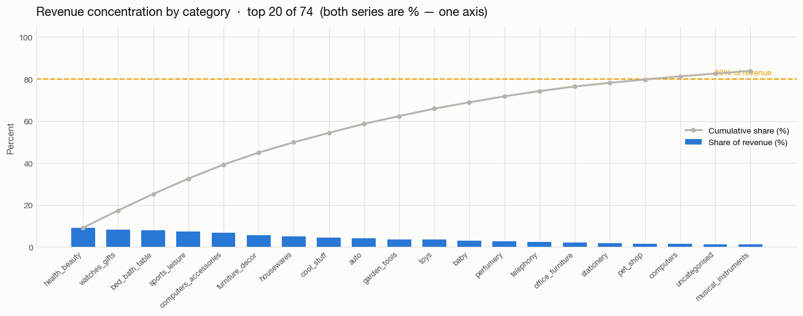
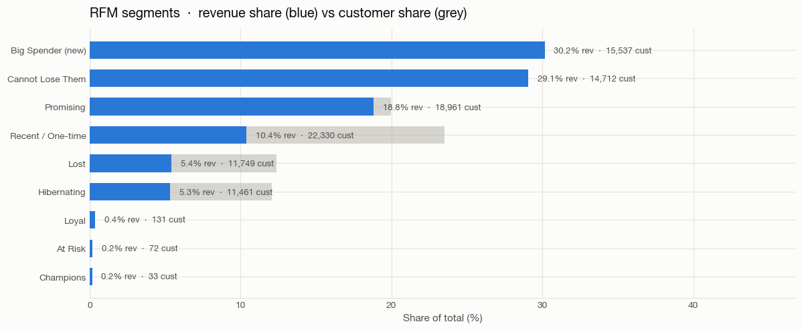
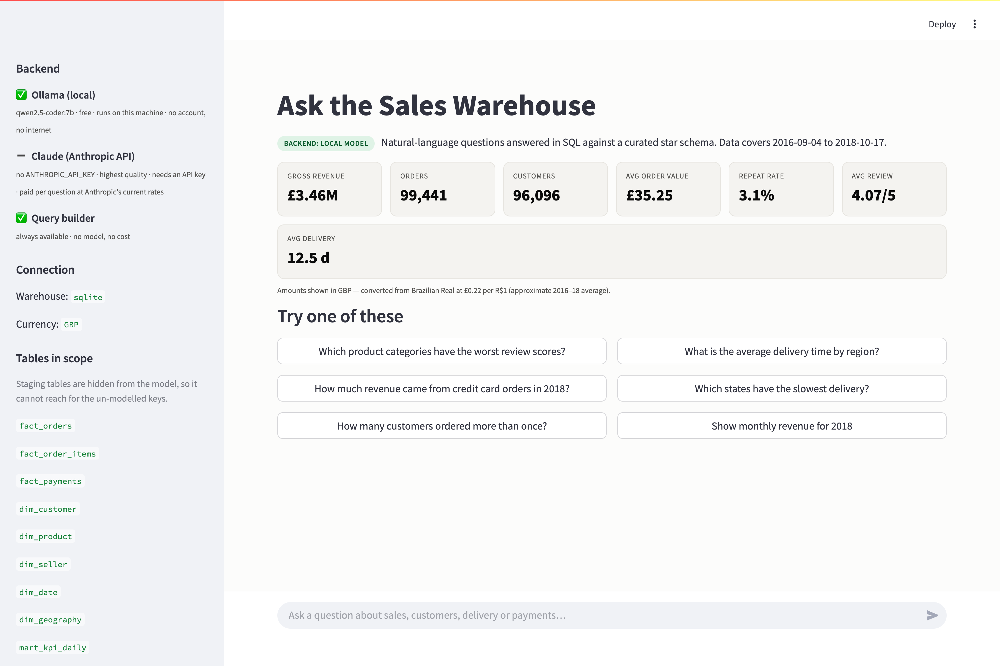
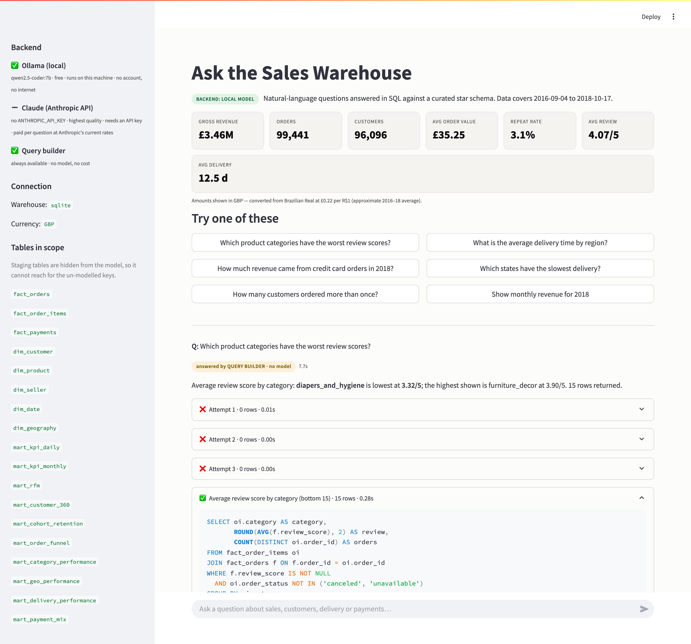
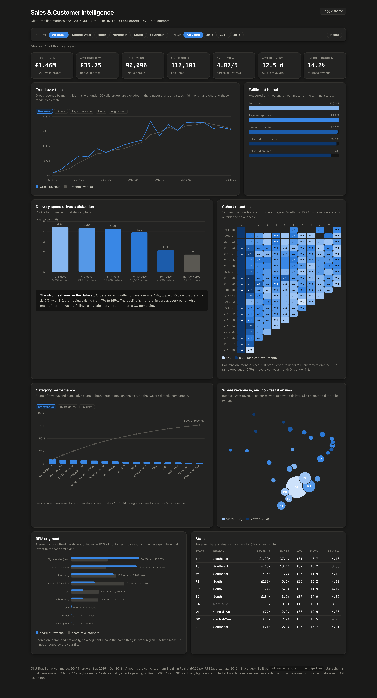

# 📊 Sales & Customer Intelligence Platform

> End-to-end analytics on **99,441 real e-commerce orders** — a Python ETL pipeline into a PostgreSQL star schema, ten analytics marts, an interactive executive dashboard, and an LLM agent that answers business questions in plain English by writing and running its own SQL.

<p align="center">
  
</p>

<p align="center">
  
  
  
  
  
  
</p>

---

## What this is

The dataset is [Olist Brazilian E-Commerce](https://www.kaggle.com/datasets/olistbr/brazilian-ecommerce) — 99,441 orders placed on a Brazilian marketplace between September 2016 and October 2018. The project turns that raw CSV dump into a production-style analytics stack: a cleaned star schema, 18 analytics marts, a fully offline interactive dashboard, and an agent you can ask questions in plain English.

Every component is connected. The same SQL models that build the warehouse also power the dashboard's embedded cubes. The same colour tokens appear in the notebook, the dashboard and the Streamlit app. The same guard that protects the database from bad SQL is the one the agent runs through. Nothing is bolted on as an afterthought.

| # | Deliverable | Detail |
|---|-------------|--------|
| 1 | **ETL pipeline** — 9 raw CSVs → staging → star schema → marts | Runs on PostgreSQL 17 **and** SQLite from one set of SQL models |
| 2 | **Star schema** — 5 dimensions, 3 facts, 18 marts, 26 SQL models | 12 data-quality checks, all passing |
| 3 | **Interactive dashboard** — 8 charts, region/year filters, click-to-filter | One HTML file, works fully offline |
| 4 | **Tableau workbook** + click-by-click setup guide | [`docs/TABLEAU_SETUP.md`](docs/TABLEAU_SETUP.md) |
| 5 | **"Ask your data" agent** — natural language → SQL → answer | Runs free: local Ollama model, or a no-model query builder |
| 6 | **Walkthrough notebook** — 35 cells, executed, charts embedded | [`notebooks/01_sales_intelligence_walkthrough.ipynb`](notebooks/01_sales_intelligence_walkthrough.ipynb) |
| 7 | **Test suite** — 179 tests, incl. headless browser render checks | `pytest` |
| 8 | **Data dictionary** — every table, column and grain | [`docs/DATA_DICTIONARY.md`](docs/DATA_DICTIONARY.md) |
| 9 | **Plain-language walkthrough** — every step, no jargon | [`docs/HOW_IT_WORKS.md`](docs/HOW_IT_WORKS.md) |

---

## The headline findings

Everything below comes from the **same 99,441-order dataset**: Olist Brazilian marketplace, Sep 2016 – Oct 2018.

| Finding | What the data shows |
|---------|---------------------|
| **Delivery speed is the dominant satisfaction lever** | 4.46/5 at ≤3 days → **2.19/5 past 30 days**, monotonic across every bucket; 1–2 star reviews rise from 7% to 65% |
| **Retention is effectively zero** | 3.1% of customers ever reorder; weighted month-1 retention is **0.45%** — an acquisition-efficiency business |
| **The funnel breaks only at the last mile** | 99.8% payment approval, 97.0% delivered — but only 90.5% *on time* |
| **Revenue is concentrated, service is not** | São Paulo is 37.4% of revenue at 8.7 days to deliver; Roraima averages 29.3 days |
| **No hero categories** | 18 of 74 categories are needed to reach 80% of revenue |
| **Freight is 14.2% of gross revenue** | And rises with distance — the margin story and the logistics story are the same story |

---

> ⚠️ **Note:** The sections below give a walkthrough of the platform's core features. Full technical depth — architecture, modelling decisions, agent design, SQL guard, data quality — is documented further down.

---

## 📽️ Platform walkthrough

### 1 · Executive Dashboard — filters & cross-filtering


*The dashboard ships as a single self-contained HTML file — no server, no database, no API key, no internet connection required. All 2,120 data rows are baked in. Selecting a region and year recomputes every panel instantly in the browser, including the auto-written summary beneath the delivery chart. Distinct counts (active customers, unique buyers) are pre-materialised for every region × period combination so they remain exact after filtering — not estimated.*

---

### 2 · Filtered view — Northeast · 2018



*Filters are real — **Northeast · 2018** recomputes all eight panels, including KPI tiles, delivery distribution, review-score breakdown, revenue trend, category pareto, geography map, RFM segments and cohort retention. The auto-written sentence beneath the delivery chart updates its phrasing to match the selection.*

---

### 3 · Delivery speed vs review score



*The clearest finding in the dataset: review score degrades monotonically with delivery time. At ≤3 days the average is 4.46/5; past 30 days it falls to 2.19/5. 1–2 star reviews rise from 7% of orders to 65%. This reframes "our ratings are falling" as a logistics target with a clear owner and a measurable threshold.*

---

### 4 · Cohort retention heatmap



*Cohorts are anchored on the first valid (non-cancelled) order. Month-0 is 100% by construction; a data-quality check asserts this and would fail the build if it weren't. Weighted month-1 retention is 0.45%. The heatmap makes the near-total absence of repeat purchasing visible at a glance — this is not a rounding error, it is the business model.*

---

### 5 · Category revenue Pareto



*18 of 74 product categories account for 80% of gross revenue. The 17th category alone only reaches 79.8% — there is no dominant hero category. The implication: the business is exposed to the long tail, and no single category can be deprioritised without meaningful revenue impact.*

---

### 6 · RFM segmentation



*RFM frequency uses fixed bands rather than quintiles. With 97% of customers buying exactly once, NTILE(5) over frequency invents loyalty tiers that don't exist in the data. Fixed bands keep the scoring honest — the near-empty Champions segment is the finding, not a display artefact.*

---

### 7 · "Ask your data" agent



*The Streamlit agent accepts a question in plain English, generates SQL, runs it against the warehouse, and returns the answer — with the SQL it ran shown next to it. Three backends are tried in order: Ollama (local, free), Claude (optional, paid), and a deterministic query builder that needs no model at all. The app displays on screen which backend answered.*

---



*A sample answer from the no-model query builder — the backend that works on a fresh clone with nothing installed. Every generated statement passes through a read-only SQL guard before execution: single statement only, SELECT/WITH only, no DDL/DML, no table outside a curated allow-list, injected LIMIT.*

---

### 8 · Dashboard — dark mode



*The dashboard supports light and dark themes, toggled client-side with no reload. All colour tokens come from `src/viz/palette.py` — the same validated palette used by the notebook charts and the Streamlit app — so every surface reads identically regardless of mode.*

---

## Quickstart

```bash
git clone <this-repo> && cd sales-platform
pip install -r requirements.txt

python scripts/download_data.py        # fetches the 9 Olist CSVs (~120 MB)
python -m src.etl.run_pipeline         # builds everything
```

**No database setup required.** The pipeline targets PostgreSQL and falls back to a local SQLite file if none is reachable, so a reviewer can clone and run in one command. For the real thing:

```bash
docker compose up -d                   # PostgreSQL 16 on :5432
python -m src.etl.run_pipeline --backend postgres
```

Then:

```bash
open dashboards/executive_dashboard.html      # the dashboard
./run_chatbot.command                         # the ask-your-data app
jupyter lab notebooks/                        # the walkthrough
pytest                                        # 179 tests
```

Pipeline output:

```
[1/4] Loading raw CSVs into staging ...
[2/4] Building SQL models ...
      dim_date  777 · dim_customer  96,096 · fact_orders  99,441 · … 26 models
[3/4] Running data-quality checks ...
      12/12 checks passed.
[4/4] Writing Tableau extracts ...
Done in 9.1s.
```

---

## Architecture

```
data/raw/*.csv                9 Olist CSVs (99,441 orders, Sep 2016 – Oct 2018)
        │
        │  src/etl/extract_load.py — typing, whitespace/case, dedupe,
        │                            geolocation collapsed 1M → 19k rows
        ▼
   stg_*  (9 staging tables)   thin: no business logic
        │
        │  sql/models/*.sql — 26 models compiled per dialect at run time
        ▼
┌────────────────────────────────────────────────────────────┐
│  STAR SCHEMA                                               │
│    dim_date · dim_customer · dim_product                   │
│    dim_seller · dim_geography                              │
│    fact_orders · fact_order_items · fact_payments          │
└────────────────────────────────────────────────────────────┘
        │
        ▼
   mart_*  (18 marts)  kpi_daily · kpi_monthly · rfm · cohort_retention
                       order_funnel · category_performance · geo_performance
                       delivery_performance · payment_mix · customer_360
                       + 8 mart_dash_* cubes (region x period rollups that make
                         the dashboard filters exact — see below)
        │
   ┌────┴──────────────┬─────────────────────┬──────────────────┐
   ▼                   ▼                     ▼                  ▼
Tableau /          Streamlit +          Jupyter            12 quality
HTML dashboard     Claude agent         notebook           checks (gate)
```

### How the dashboard filters stay exact

Changing a filter re-draws in the browser from data embedded in the file — no server, no query. That only works if the numbers were right up front, and one class of number cannot be recomputed client-side: **distinct counts are not additive.** Summing "active customers" across three months double-counts anyone who bought twice; summing across regions double-counts anyone who moved.

The `mart_dash_*` models materialise an explicit `'ALL'` rollup row alongside the per-region rows, and the front end looks up the right one instead of adding up. It costs 24 rows for the KPI cube and removes the whole bug class. Tests assert the regions sum to the national total:

```python
def test_dash_kpi_regions_sum_to_all(q):
    assert total["orders"].iloc[0] == parts["orders"].sum()
```

### Why the SQL models compile to two dialects

Every model is written **once** against a small macro layer and compiled to the target dialect at run time:

```sql
-- sql/models/31_mart_kpi_monthly.sql
SELECT {{ month_start(order_date) }} AS month_start_date, ...
```

```
-> postgresql : CAST(DATE_TRUNC('month', order_date) AS DATE)
-> sqlite     : DATE(order_date, 'start of month')
```

This keeps PostgreSQL as the real target while letting the whole project run with zero setup — without maintaining two copies of the SQL that would drift apart. `src/etl/sql_runner.py` also parses dbt-style headers (`-- materialized:`, `-- depends_on:`) and fails fast on a bad build order.

---

## The modelling decisions that matter

**1. `customer_id` is not a customer.** Olist mints a new `customer_id` for every order; `customer_unique_id` identifies the person. Build `dim_customer` on the wrong one and every buyer looks new — repeat rate reads 0.00% and cohort retention is a flat line of zeros. This single choice is what makes the RFM and retention work meaningful.

**2. Revenue lives at the line-item grain.** `price` is per unit shipped, so three identical mugs are three rows. `fact_orders` pre-aggregates items, payments and reviews in separate CTEs *before* joining, so the classic fan-out (an order with 3 items and 2 payment rows reporting 6× revenue) can't occur. A data-quality check asserts the two grains reconcile to within R$1.

**3. The funnel is built on timestamps, not status.** `order_status` says where an order ended up; the milestone timestamps say which stages it passed through. Only the latter gives real stage-to-stage conversion.

**4. RFM frequency uses fixed bands, not quintiles.** With 97% of customers buying exactly once, `NTILE(5)` over frequency slices an all-1s column into five bands and invents loyalty tiers that don't exist. Fixed bands keep the score honest — and the resulting near-empty Champions segment *is* the finding.

**5. Cohorts are anchored on the first *valid* order.** Anchoring on the first order of any kind (including cancelled) put month 0 below 100% — caught by a quality check, not by eye.

---

## The "ask your data" agent

```
You: Which product categories have the worst review scores?

  ▸ Average review score by category (bottom 15)         15 rows · 0.18s
    SELECT oi.category AS category,
           ROUND(AVG(f.review_score), 2) AS review, ...
    HAVING COUNT(*) >= 20
    ORDER BY review ASC

  Average review score by category: diapers_and_hygiene is lowest at 3.32/5;
  the highest shown is furniture_decor at 3.90/5. 15 rows returned.
```

*(That transcript is the no-model query builder — the backend that works on a fresh clone. With Ollama running you can ask the same thing in any phrasing.)*

### It costs nothing to run

Three backends, tried in order. The app **says on screen which one answered**.

| Backend | Cost | Notes |
|---------|------|-------|
| **Ollama** (`qwen2.5-coder:7b`) | free | Runs on your machine. No account, no key, offline, nothing leaves the laptop |
| **Claude** | paid | Better SQL on multi-step questions. Strictly optional |
| **Query builder** | free | No model at all. ~400 lines of Python matching 10 measures × 11 breakdowns |

The third one is the reason there is no dead end: clone the repo, run the app, ask a question, get a real answer computed from real data — with nothing installed and no key. It is also deterministic, so it is what the notebook pins and what the test suite drives end to end.

### Design choices worth calling out

- **The guard is the security boundary, not the prompt.** A prompt is a request; a model can ignore one and a user can argue one away. Every generated statement passes through `src/llm/sql_guard.py` — single statement only, `SELECT`/`WITH` only, no DDL/DML keyword as a bare word, no table outside the curated allow-list, injected `LIMIT` — no matter which backend wrote it. Comments and string literals are stripped before keyword scanning, so `WHERE status = 'created'` passes while `SELECT … -- ; DROP TABLE` is blocked. 39 cases, 19 of which must be rejected, in [`tests/test_sql_guard.py`](tests/test_sql_guard.py).
- **Staging tables are hidden from the model.** It sees only the curated layer, so the modelling decisions above are *enforced* rather than suggested — it cannot reach for the per-order `customer_id` because it never sees it.
- **Checking the SQL is not enough.** A query can be valid, safe, permitted and still answer the wrong question. A negative average delivery time means the model picked `delivery_vs_estimate_days`; a grouped result with no label column means it grouped by something it never selected. Both are detectable, and both earn a retry with an explanation instead of an answer built on them.
- **The model never does arithmetic.** It is told to quote figures from the result and never to compute one. It is also told to write amounts in R$ and never to convert — the currency conversion happens afterwards, in Python. A number a model worked out itself is indistinguishable from one it invented. This rule exists because a 7B model confidently reported a year total that was 13% wrong.
- **A failing model falls back to the query builder** rather than dead-ending, and the answer is then attributed to the builder — never passed off as the model's.
- **Low-cardinality columns ship their real values** in the schema briefing. Without them the model guesses literals and `WHERE category = 'Health & Beauty'` silently returns zero rows against a column holding `health_beauty`.

---

## Currency

Every amount in the warehouse is Brazilian Real — Olist is a Brazilian marketplace. The dashboard, notebook and chatbot display **pounds**, which means the figures are *converted, not relabelled*: a fixed rate documented in [`src/viz/money.py`](src/viz/money.py), applied at display time only, and disclosed wherever it is used.

The distinction is the point. Swapping `R$` for `£` without applying a rate overstates every figure by roughly 4.5x while still looking entirely plausible — so a test fails the build if an unconverted amount reaches the dashboard. The rate is a constant rather than a live lookup because the data is historical (2016–18), and because a live rate would make every rebuild produce different numbers. Set `DISPLAY_CURRENCY=BRL` in `.env` to see the source values.

---

## Data quality

The pipeline exits non-zero if any check fails, so a broken model can't silently ship a dashboard.

```
orders_row_count                   99,441  == 99,441 (published Olist count)   [PASS]
revenue_reconciles_to_line_items     0.00  < R$1.00 between order and item grain [PASS]
customers_collapse_ratio           96,096  unique people < order-level ids      [PASS]
cohort_retention_month0_is_100pct   100.0  == 100% by definition                [PASS]
… 12 checks total
```

Two of these caught real bugs during development: revenue reconciliation and the cohort month-0 assertion. They're contracts, not smoke tests.

---

## Project layout

```
sql/models/            26 SQL models — the star schema and marts
  10-15_dim_*.sql      dimensions       20-22_fact_*.sql   facts
  30-39_mart_*.sql     analytics marts
src/
  config.py            warehouse resolution (Postgres → SQLite fallback)
  etl/
    extract_load.py    CSV → staging
    sql_runner.py      dbt-style model runner + dialect macro layer
    checks.py          12 data-quality assertions
    export_extracts.py Tableau extracts
    run_pipeline.py    CLI entry point
  llm/
    agent.py           retry loop, sanity checks, fallback
    providers.py       Ollama / Claude / none, behind one interface
    query_builder.py   deterministic NL->SQL, needs no model
    sql_guard.py       read-only SQL policy  ← the security boundary
    schema_context.py  generated schema briefing
  viz/palette.py       validated colour tokens, shared by every surface
  viz/money.py         BRL -> display currency, in one place
  app/streamlit_app.py
scripts/               download_data · build_notebook · build_dashboard
                       build_tableau · build_data_dictionary
                       build_screenshots — regenerates docs/images from the
                       artefacts, so no image can quietly go stale
tests/                 179 tests
```

Charts across the notebook, the app and the dashboard all read their colours from `src/viz/palette.py`. The palettes were checked with a contrast and colour-vision validator rather than picked by eye; the passing output is recorded next to each set.

---

## A note on verification

Everything claimed above was executed, except where stated:

| Component | Status |
|-----------|--------|
| ETL, star schema, marts, 12 checks | **Verified** on PostgreSQL 17.4 and SQLite 3.45 — **all 2,120 dashboard rows identical** across both engines, from one set of SQL models compiled to each dialect |
| 179 tests | **Verified** — all passing on **both** PostgreSQL 17.4 and SQLite |
| Notebook | **Verified** — executed end to end, outputs embedded, no errors |
| HTML dashboard | **Verified** — rendered and reviewed in light and dark |
| SQL guard | **Verified** — 39 cases, 19 of which must be rejected, all behaving as specified |
| Dashboard interactivity | **Verified** — 17 headless-browser tests drive the real controls and assert every panel drew. The suite was itself validated by injecting a syntax error and confirming it fails |
| Streamlit app | **Verified** — driven in a headless browser: renders, answers a question end to end, no console errors |
| Ollama agent (free path) | **Verified** — `qwen2.5-coder:7b` running locally, answering against the real warehouse in 4–10s |
| Query-builder agent (no model) | **Verified** — every question the UI suggests parses, runs and returns rows |
| Live Claude agent | **Not verified** — no API key was available on the build machine. The provider is exercised through a scripted stand-in, which covers the agent loop but not Anthropic's API itself. |
| Currency conversion | **Verified** — the rate is applied, disclosed on every surface, and a test fails if an unconverted R$ amount reaches the dashboard |
| `sales_intelligence.twb` | **Not verified** — Tableau Desktop is a GUI app and wasn't available. XML is well-formed but has never been opened. [`docs/TABLEAU_SETUP.md`](docs/TABLEAU_SETUP.md) is the reliable path and teaches you the tool. |

---

## Data

[Olist Brazilian E-Commerce](https://www.kaggle.com/datasets/olistbr/brazilian-ecommerce)
— 99,441 orders placed on a Brazilian marketplace between September 2016 and
October 2018, released by Olist under CC BY-NC-SA 4.0.

`scripts/download_data.py` pulls the nine CSVs from a public mirror (Kaggle requires an account) and **asserts the row count of each file**, so a truncated or substituted mirror fails loudly rather than producing quietly wrong analytics.
